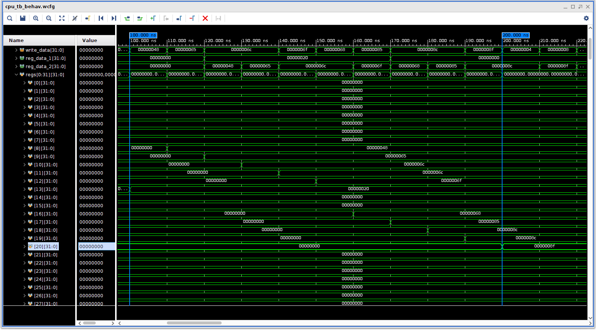
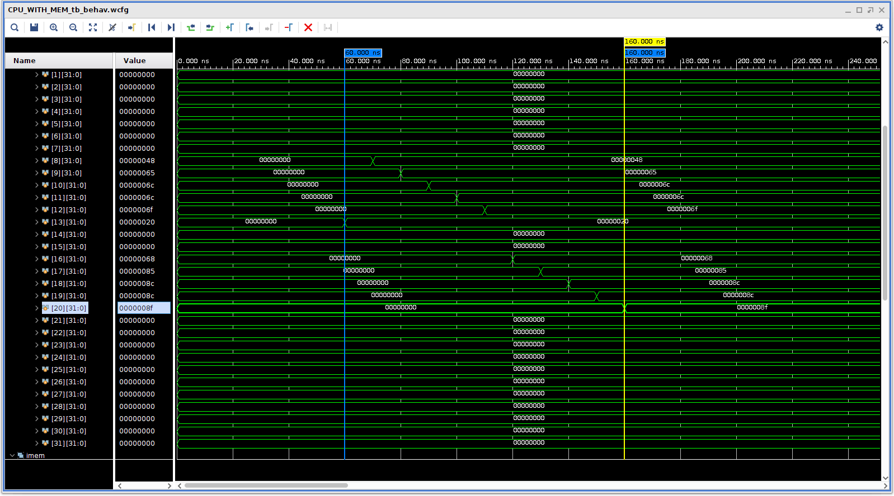
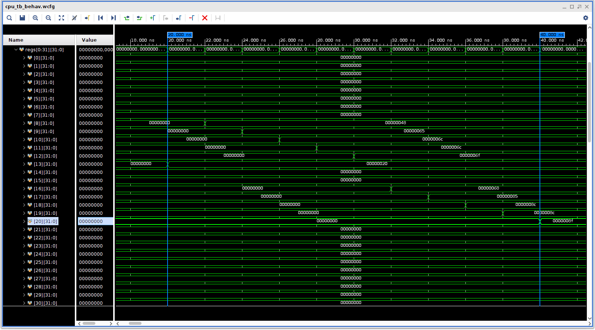

# Pipelined MIPS CPU
A fully functional 32-bit five-stage pipelined MIPS processor implemented in Verilog. This project explores modern CPU architecture by implementing instruction-level parallelism, pipeline registers, hazard detection, data forwarding, and modular datapath design from the ground up.
## Features
- Five-stage instruction pipeline (IF, ID, EX, MEM, WB)
- Hazard detection unit
- Data forwarding
- Branch and jump support
- 32 general-purpose registers
- 256-word instruction and data memories
- 10 implemented instructions
- Custom instruction memory loading using .mem files
- Simulation verified using test programs
## Acknowledgements 
Heavily inspired by: Digital Design and Computer Architecture, 2nd Edition written by David Money Harris and Sarah L. Harris.
# What makes a CPU pipelined?
Pipelining here refers to instruction pipelining. It divides instructions into a series of steps which can be split up and performed in parallel. This aims to keep all portions of the processor occupied to increase throughput. A typical five stage pipeline consists of five stages:

- **IF (Instruction Fetch)** - fetch instruction from the instruction memory using the program counter.
- **ID (Instruction Decode)** - decode instruction.
- **EX (Execute)** - execute instruction using ALU / bit shifter.
- **MEM (Memory access)** - write results to the data memory if needed.
- **WB (Register write back)** - write results back to register file.

This is achieved using pipeline registers. Pipeline registers store important values in between stages, to facilitate multiple instructions simultaneously. Four pipeline registers are inserted between each stage in the data-path.

```
             Cycle
              1   2   3   4   5   6   7   8
Instruction 1 IF  ID  EX  MEM WB
Instruction 2     IF  ID  EX  MEM WB
Instruction 3         IF  ID  EX  MEM WB
Instruction 4             IF  ID  EX  MEM WB
```

*Example of pipelined data timing*

At time zero, the first instruction is fetched from memory, and stored in the pipeline register. Then the next instruction is fetched while the previous instruction is decoded, and so on.

Let's compare the pipelined CPU to a single cycle CPU (you can find the link to my single-cycle RISC CPU [here](https://github.com/fionn-smyth-25/simple-RISC-CPU/)). Both CPUs are running the same program, `upper_to_lower.mem`, which is available in the programs directory. The program loads the string 'HELLO' into registers `$t0` through `$t4`. The string is then convert to lowercase by adding 0x20h to each register, before storing each letter in the data memory.



*Pipelined CPU running upper_to_lower.mem*



*Single-cycle CPU running upper_to_lower.mem*

Reset is held high for five clock cycles for each design. Note the two blue markers - these mark the first and last register writes respectively. Each CPU takes the same amount of cycles in between writes, but the single-cycle CPU executes its first write earlier than the pipelined CPU. This is because the single-cycle CPU executes each instruction in a single cycle, whereas the pipelined CPU is simultaneously executing multiple parts of different instructions at once. Therefore, the actual write occurs in the cycles *after* the instruction computation is performed in the ALU. It's important to remember that pipelining does not reduce the latency of an individual instruction. Instead, it improves throughput by allowing multiple instructions to be processed simultaneously.

You might wonder what exactly is the benefit of using pipelining if the programs execute in the same amount of cycles. Well, it's important to note that both the CPUs in the test above are running with an identical clock period of 10ns. The advantage of a pipelined CPU is that it can run at much higher clock speeds:



*Pipelined CPU running upper_to_lower.mem with a clock period of 2ns*

The time from first to last write shrinks from 100ns to 20ns. The single-cycle CPU cannot operate reliably with such a short clock period because the entire instruction path must complete within one cycle. The pipelined CPU divides this path into smaller stages, allowing a much higher operating frequency.
## Hazards
Hazards occur when instructions in a pipeline produce an incorrect answer. This can occur in a couple of ways:
- Structural hazards: two instructions require the same hardware resource.
- Data hazards: an instruction depends on the result of a previous instruction.
- Control hazards: caused by branches and jumps.

An example of a RAW (read after write) hazard is as follows: 

```
add $s0, $s2, $s3
and $t0, $s0, $s1
```

The add instruction writes a result into $s0, but $s0 will be read in the very next instruction. Due to the pipeline process, $s0 will be read before the correct value has been written there, so instruction two will produce an incorrect answer. We can solve this hazard by *forwarding* the result from later pipeline stages (EX/MEM or MEM/WB) directly back to the execute stage.

We can solve these problems by implementing a hazard unit in our design. The hazard unit decides whether to forward, stall (to wait for other parts of the CPU to catch up), or flush (clear a pipeline register). The hazard unit allows the CPU to reap all the rewards of pipelining without worrying about the drawbacks. 
# Design Description
## Modules
The module hierarchy is as follows:
```
top.v
├── hazard_unit.v
├── control_unit.v
├── ifetch.v
	└── imem.v
├── ifetch_idecode_reg.v
├── idecode.v
	└── regfile.v
├──	idecode_exe_reg.v
├── execute.v
	└── alu.v
├──	exe_mem_reg.v
├── memory.v
	└── dmem.v
├──	mem_write_back_reg.v
├── write_back.v
```
